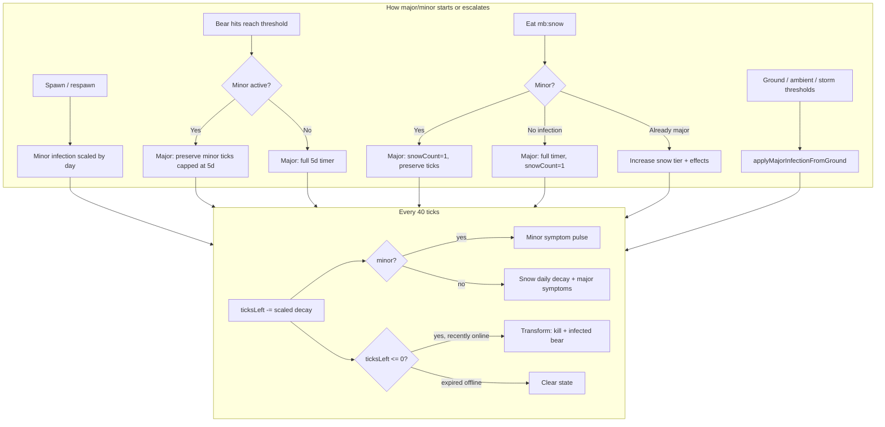
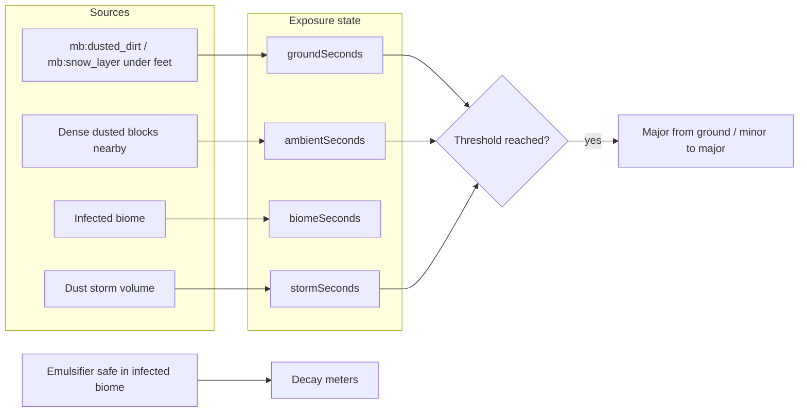
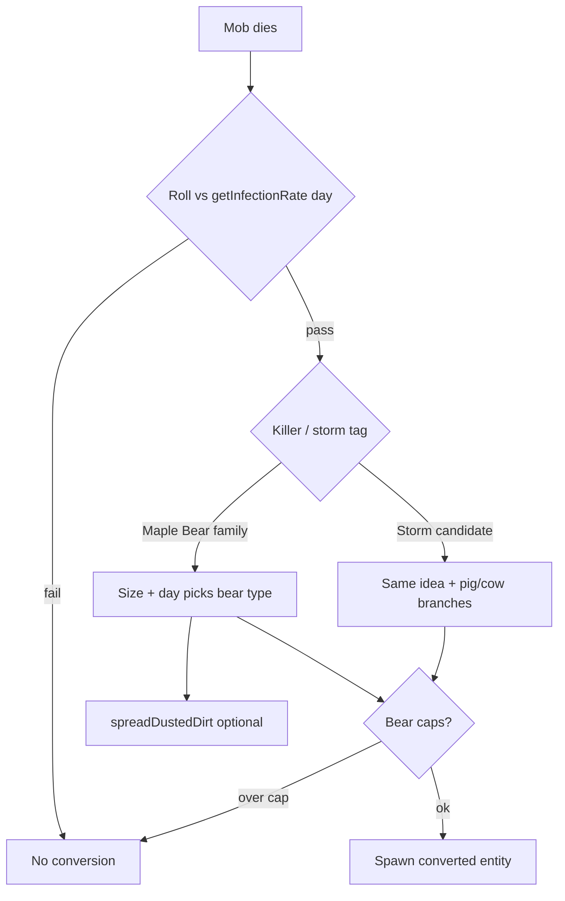

# Infection System (Player, Environment, World)

This document describes how **player infection**, **white powder (`mb:snow`)**, **environmental pressure** (ground, ambient dust, biomes, storms), **mob conversion**, and **transformation** work in code. Primary implementation: `BP/scripts/main.js`. Related: `mb_snowStorm.js`, `mb_infectedAI.js`, `mb_biomeAmbience.js`, `mb_dimensionAdaptation.js`, `mb_dynamicPropertyHandler.js` (difficulty).

---

## 1. Concepts at a glance

| Concept | Meaning |
|--------|---------|
| **Minor infection** | Long-timer “baseline” state: assigned on first spawn and after death (if not permanently immune). Mild periodic effects. Curable with golden apple + golden carrot. |
| **Major infection** | Short-timer crisis state: bear hits, eating powder, or environment crossing thresholds. Stronger symptoms, snow tiers, cures only with **weakness + enchanted golden apple**. |
| **`snowCount`** | “Powder load” during **major** infection: raised by eating `mb:snow`, repeated bear hits while major, and periodic exposure while standing on corrupted ground. Drives tiers, timer shifts, and extra daily decay. |
| **Exposure timers** | Separate per-player meters for ground, ambient dust density, infected biome, and storm—used to apply or escalate infection without a bear hit. |

---

## 2. Data model (`InfectionState`)

Stored in `playerInfection` (`Map` keyed by player id). Important fields:

- **`ticksLeft`** — Time until transformation if uncured (minor uses a **day-scaled** starting value; major caps at **5 in-game days** = `24000 * 5` ticks).
- **`snowCount`** — Severity of powder during major infection (fractional values allowed).
- **`infectionType`** — `"minor"` or `"major"`.
- **`source`** — How infection started or last major source: e.g. `"spawn"`, `"bear"`, `"snow"`, `"ground"`.
- **`cured`** — Major cure clears entry; minor cure sets permanent immunity flags.
- **`warningSent`** — One-minute-before-transform message.
- **`lastActiveTick`** — Used so transformation from timer only happens if the player was recently online (grace for offline expiry).

Bear hit progress before infection uses **`bearHitCount`**. Ground/storm pressure uses **`groundExposureState`** (separate map).

---

## 3. Addon difficulty (hits and timer speed)

From `mb_dynamicPropertyHandler.js` → `getAddonDifficultyState()`:

| Difficulty | `hitsBase` | Bear hits to first **major** (no minor) | Hits minor→major |
|------------|------------|----------------------------------------|------------------|
| Easy | 4 | 4 | 3 |
| Normal | 3 | 3 | 2 |
| Hard | 2 | 2 | 1 |

**Permanent immunity** (after curing minor or major): needs **`hitsBase`** hits to get major again (not `hitsBase - 1`).

**Minor infection**: needs **`max(1, hitsBase - 1)`** hits from Maple Bears to escalate to major.

Timer tick rate uses **`infectionDecayMultiplier`** on the same difficulty object (major/minor loop subtracts scaled ticks each interval).

---

## 4. Minor infection

### 4.1 When it applies

- **First join** / initialization when no infection data exists: `initializeMinorInfection()`.
- **After death** if the player had major infection cleared on death (`handlePlayerDeath`) and they are **not** permanently immune: minor is restored on respawn (see spawn/load path in `main.js`).

### 4.2 Timer scaling

`getScaledMinorInfectionTicks(currentDay)` reduces the starting duration as world days increase (e.g. shorter minor timer in late game). Upper design cap in constants is **10 days** of ticks, but the **starting** value is the scaled amount.

### 4.3 Effects

On each **40-tick** interval of the main infection loop, minor players get severity based on **fraction of time remaining** (same band idea as major: >75%, >50%, >20%, else severe). Random effect from tier-appropriate pools; cooldowns **7200 / 4800 / 3600 / 2400** ticks for severity 0–3 respectively.

### 4.4 Cure

**Golden apple** and **golden carrot** in **either order**, tracked with dynamic properties `mb_minor_cure_golden_apple` / `mb_minor_cure_golden_carrot`. Completing both runs `cureMinorInfection()`: clears minor state, sets **permanent immunity**, updates codex.

### 4.5 Death

Minor infection **persists through death** (state kept; tag reapplied on respawn). Major infection is cleared on death so the next life starts from the “respawn → minor” path unless immune.

---

## 5. Major infection

### 5.1 How you get major

1. **Bear hits** — Enough hits without temporary immunity; if you have **minor**, one fewer hit than the “fresh player” count.
2. **Eat `mb:snow`** — If not permanently immune: first bite can start major with `snowCount: 1`; if **minor**, immediately converts to major and sets `snowCount: 1` while preserving timer (capped to major max).
3. **Environment** — `groundSeconds`, `ambientSeconds`, or `stormSeconds` cross thresholds → `applyMajorInfectionFromGround()` (new major or minor→major with timer rules similar to other paths).
4. **Permanently immune** — After enough hits, same as normal major apply (overcome immunity).

### 5.2 Timer and main loop

- **40-tick** `system.runInterval`: decrements `ticksLeft` using **`infectionDecayMultiplier`**.
- **Optional UI**: subtitle days-left if player enabled infection timer in settings.
- **One minute before zero**: warning message; at zero → `handleInfectionExpiration()` (kill + spawn infected bear form if recently active online).

### 5.3 Snow tiers and `getSnowTimeEffect`

Rough bands (by `snowCount`): **1–5, 6–10, 11–20, 21–50, 51–100, 100+** (“Black Void”). Eating powder or gaining powder adjusts `ticksLeft` by a computed **time effect** (early tiers slightly extend, high tiers shorten aggressively).

### 5.4 Snow increase from bear hits (already major)

`SNOW_INCREASE` per attacker family (tiny, infected, buff, flying, mining, torpedo). Updates `snowCount`, reapplies time effect, can trigger immediate expiration if timer hits zero.

### 5.5 Major symptoms

Combines **time remaining** (`getSymptomLevel`) with **snow-driven severity** for effect choice, duration, and cooldown. **5%** chance of a short “clarity” positive effect instead of a negative one.

### 5.6 Daily snow decay (major only)

Once per **24000 ticks** (1 in-game day), extra `ticksLeft` loss scales with `snowCount` tier (higher powder → faster collapse).

### 5.7 Eating powder while major

Increments `snowCount`, applies tier messages/sounds, `applySnowTierEffects()` (random potion burst by tier).

### 5.8 Normal golden apple

While **major**, reduces **`snowCount` by 0.5** (does not cure). If **minor**, apple is consumed as part of **minor cure** tracking instead (no snow reduction branch).

### 5.9 Major cure

**Enchanted golden apple** while infected: only cures if **`hasWeaknessEffect(player)`** is true. Clears infection, grants **permanent immunity**, **temporary** post-cure immunity window, codex updates. Weakness is not removed by script (runs out naturally).

---

## 6. Environmental infection pressure

### 6.1 Corrupted blocks

Standing on **`mb:dusted_dirt`** or **`mb:snow_layer`** (feet or below) counts as infected ground. **`mb:snow_layer`** applies a **2×** speed multiplier to ground/major accumulation.

Boats and some water cases skip counting (see `isStandingOnInfectedGround`).

### 6.2 Two-speed checking

- Slow interval adds/removes players from **`playersOnInfectedGround`** when near corrupted blocks (including short jumps above them).
- Fast interval (**20 ticks**) increments exposure timers while tracked.

### 6.3 Timer buckets (`groundExposureState`)

- **`groundSeconds`** / warnings / **`ambientSeconds`** (many dusted blocks in radius)—see `AMBIENT_PRESSURE_RADIUS` and `AMBIENT_PRESSURE_THRESHOLD` in `main.js`.
- **`biomeSeconds`** — pressure while in infected biome (slow).
- **`stormSeconds`** — from `getStormExposureRates()` in `mb_snowStorm.js` (faster than current ground rates).

Crossing infection thresholds calls **`applyMajorInfectionFromGround`**, then resets the relevant timers.

### 6.4 Emulsifier safe zone

Inside an **infected biome** + **emulsifier no-spawn zone**: exposure timers **decay** instead of building (aligned with safe-zone behavior in storm/biome ambience).

### 6.5 Permanent immunity on environment

**Half** `gainMultiplier` on exposure accumulation (still can eventually infect if thresholds are reached).

### 6.6 Already major: powder creep from ground

**`majorSeconds`** accumulates while on corrupted ground; every **`GROUND_MAJOR_SNOW_INTERVAL_SECONDS`** (with decay when off ground) triggers **`applySnowExposureIncrease(..., fromGround=true)`** → **+0.25** `snowCount`, nausea, limited chat.

---

## 7. Transformation (player → infected bear)

### 7.1 Timer runs out

`handleInfectionExpiration`: kills player, spawns infected bear at location, name tag `§4! <name>'s Infected Form`, `infected_by` property. Bear variant by day: **≥13 → day13**, **≥8 → day8**, else base **`mb:infected`** (no day-20 variant on this path in current code). Broadcast + daily log entry.

If infection expired while **offline** (not recently active), state is cleared **without** spawning.

### 7.2 Killed by any Maple Bear family

`handleInfectedPlayerDeath`: if damage source is a Maple Bear type (including infected pig/cow), spawns infected form with variant **including day 20** when `currentDay >= 20`.

---

## 8. World infection (mobs and blocks)

### 8.1 Conversion chance

`getInfectionRate(day)` — **0** before day **2**, then stepped up to **100%** by day **20**. Used for bear kills and storm-tagged deaths.

### 8.2 Bear kill conversion (`handleMobConversion`)

If killer is Maple Bear family: pigs → infected pig, cows → infected cow; other mobs → Maple Bear type by **mob size** and **day** (tiny vs infected vs buff branches). Skips bear-on-bear. **Caps**: e.g. **40** bears in radius, buff bear count rules for large mob → buff conversion.

### 8.3 Storm conversion

If death is attributed to storm exposure (`wasKilledByStorm`), `handleStormMobConversion` runs similar rolls (pigs/cows special-cased).

### 8.4 Dusted dirt spread

Bear kills trigger **`spreadDustedDirt`** (radius/chance scales with victim and day), creating more **`mb:dusted_dirt`** (tracked with caps and aging cleanup).

### 8.5 Storms (`mb_snowStorm.js`)

Storms move, place/replace **`mb:snow_layer`**, damage mobs, track player **`stormSeconds`** for infection, particles/audio. Start day gated by **difficulty** (`getStormStartDay`: easy 13, normal 8, hard 4).

---

## 9. AI and presentation

- **`mb_infectedAI.js`**: Pathfinding for infected bears/pigs/cows; gap jump; anger propagation when players are hit.
- **`mb_biomeAmbience.js`**: Infected biome ambient sound when not in emulsifier safe zone.
- **Codex / journal**: Many discoveries and hints tied to infection state (`mb_codex.js`).

---

## 10. Flowcharts

### 10.1 Player infection entry and loop

### 10.2 Environmental pressure

### 10.3 Mob conversion

---

## 11. Quick reference — key files and symbols

| Area | Location |
|------|-----------|
| State maps, bear hit handler, ground loops, cures, transformation | `main.js` — `playerInfection`, `groundExposureState`, `entityHurt`, `entityDie`, `itemCompleteUse`, `system.runInterval` infection blocks |
| Storm exposure constants and storm logic | `mb_snowStorm.js` |
| Difficulty `hitsBase`, decay multipliers | `mb_dynamicPropertyHandler.js` |
| Infected mob movement / anger | `mb_infectedAI.js` |
| Infected biome ambience | `mb_biomeAmbience.js` |

---

## 12. Related docs

- **[MECHANICS_SUMMARY.md](../tracking/MECHANICS_SUMMARY.md)** — Shorter checklist of implemented mechanics (points here for infection depth).
- **[SNOW_STORM_DESIGN.md](../SNOW_STORM_DESIGN.md)** — Storm design notes (implementation may differ slightly; trust code for numbers).
- **[ADDON_SYSTEMS_AND_FEATURES.md](../ADDON_SYSTEMS_AND_FEATURES.md)** — High-level script map.

When numbers in this doc and code disagree, **code wins**—tuning changes often land in `main.js` constants first.
